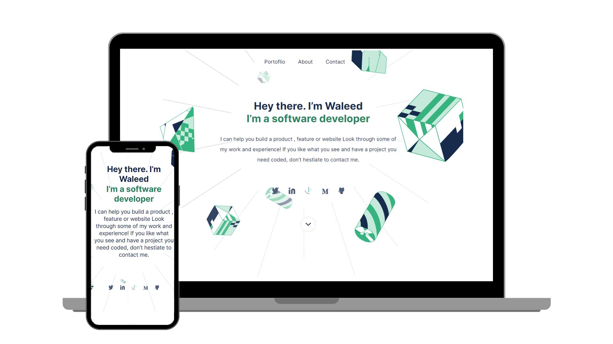

<a name="readme-top"></a>

<!-- PROJECT DESCRIPTION -->

# 📖 Portfolio <a name="about-project"></a>

With this project, you'll be able to showcase your work in a beautiful, fully functional portfolio website. 

<div align="center"></div>

## 🛠 Built With <a name="built-with"></a>

### Tech Stack <a name="tech-stack"></a>

- HTML
- CSS
- JavaScript

<details>
<summary>Client</summary>
</details>

<!-- Features -->

### Key Features <a name="key-features"></a>

- Built using only HTML, CSS, JavaScript
- You can easily create your portfolio using this repository.


<p align="right">(<a href="#readme-top">back to top</a>)</p>

<!-- GETTING STARTED -->

## 💻 Getting Started <a name="getting-started"></a>

To get a local copy up and running, follow these steps.

### Prerequisites

- Live Server

### Setup

#### Github
- Enter this url: [https://github.com/sdanishka](https://https://github.com/sdanishka) in your web browser.
-

### Usage

To run the project:

- Open `index.html` on live server.

### Run tests

To run tests, run the following command:

```
npm run test
```

### Deployment

You can deploy this project using:

- Github Pages
- Netlify

<p align="right">(<a href="#readme-top">back to top</a>)</p>


<!-- ACKNOWLEDGEMENTS -->

## 🙏 Acknowledgments <a name="acknowledgements"></a>

- A big thanks to [@microverseinc](https://github.com/microverseinc) for the project idea, guidance and inspiration.

<p align="right">(<a href="#readme-top">back to top</a>)</p>

<!-- FAQ  -->

## ❓ FAQ <a name="faq"></a>

- **What inspired me to create this project?**

  - The inspiration for this project came from microverse – a software development bootcamp where you work with teammates remotely on different projects.

<p align="right">(<a href="#readme-top">back to top</a>)</p>
